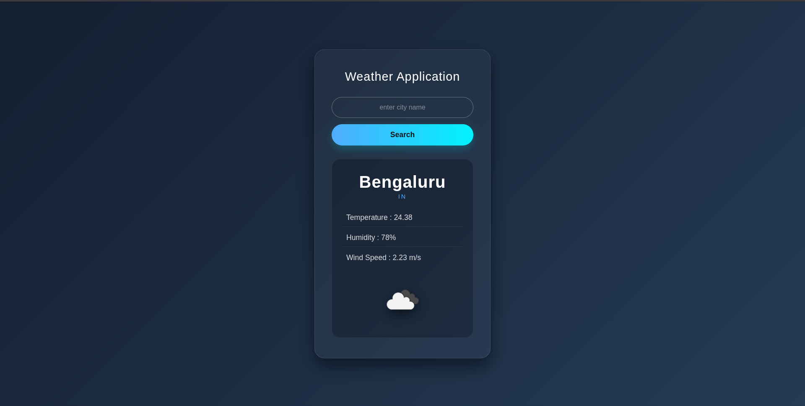

# Weather-App-Algoorbit

A weather application built with Node.js, Express, and EJS that provides real-time weather information for any city using the OpenWeatherMap API.

## Live Demo

https://weather-app-algoorbit.vercel.app/

## Screenshot



## Features

- Search weather by city name
- Real-time weather data from OpenWeatherMap
- Temperature, humidity, and wind speed details
- Weather condition icons
- Country information for searched locations
- Error handling for invalid city names
- Clean and responsive user interface

## Tech Stack

**Frontend**
- HTML5
- CSS3
- EJS

**Backend**
- Node.js
- Express.js

**API**
- OpenWeatherMap API

**Packages**
- Axios
- Dotenv
- Nodemon

## Installation

Clone the repository:

```bash
git clone https://github.com/AtmikaNayak/Weather-App-Algoorbit.git
```

Navigate to the project directory:

```bash
cd Weather-App-Algoorbit
```

Install dependencies:

```bash
npm install
```

Create a `.env` file in the project root:

```env
OPENWEATHER_API_KEY=your_api_key_here
```

Start the application:

```bash
npm start
```

For development:

```bash
npm run dev
```

Visit:

```text
http://localhost:5000
```

## Getting an API Key

This project uses the OpenWeatherMap API.

1. Create an account at https://openweathermap.org/
2. Generate an API key from https://home.openweathermap.org/api_keys
3. Add the key to your `.env` file

## Project Structure

```text
Weather-App-Algoorbit/
│
├── api/
│   └── app.js
├── public/
│   ├── style.css
│   └── weather-app.png
├── views/
│   └── index.ejs
├── .env
├── .gitignore
├── package.json
├── vercel.json
└── README.md
```

## Author

Atmika Nayak

GitHub: https://github.com/AtmikaNayak